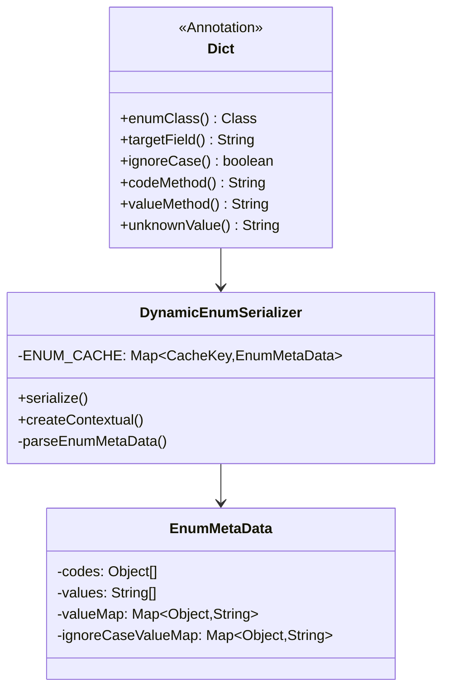
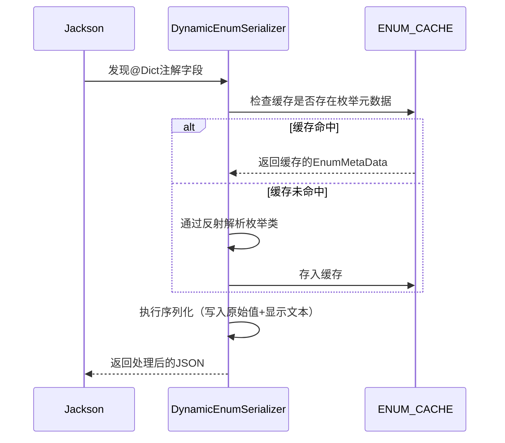

# 动态枚举序列化：优雅处理字典值与显示文本的映射

## 一、背景与痛点

在业务系统开发中，我们经常需要处理各种状态码、类型码等枚举值。例如：

```java
// 订单状态
@Getter
public enum OrderStatus {
    UNPAID(1, "待支付"),
    PAID(2, "已支付"),
    CANCELED(3, "已取消");
}
```

前端展示时，我们不仅需要返回状态码（如`status=1`），还需要返回对应的状态文本（如`statusName="待支付"`）。传统实现方式存在以下问题：

1. **重复劳动**：每个DTO都需要为枚举字段添加对应的`xxxName`字段
2. **硬编码**：转换逻辑分散在各处，难以统一维护
3. **灵活性差**：不同枚举可能有不同的code/value获取方式

## 二、解决方案：基于Jackson的自定义注解序列化

通过自定义`@Dict`注解和`DynamicEnumSerializer`实现以下能力：

1. **自动转换**：根据枚举值自动填充显示文本
2. **灵活配置**：支持自定义code/value获取方法
3. **高性能**：采用缓存机制优化性能



## 三、关键实现解析

### 1. 注解定义

```java
@Target(ElementType.FIELD)
@Retention(RetentionPolicy.RUNTIME)
@JacksonAnnotationsInside
@JsonSerialize(using = DynamicEnumSerializer.class)
public @interface Dict {
    Class<? extends Enum<?>> enumClass();       // 关联的枚举类
    String targetField() default "";            // 目标字段名（默认原字段名+Name）
    boolean ignoreCase() default false;         // 是否忽略大小写
    String codeMethod() default "getCode";      // 获取code的方法名
    String valueMethod() default "getValue";    // 获取显示值的方法名
    String unknownValue() default "未知状态";     // 未知枚举的默认值
}
```

### 2. 序列化逻辑



### 3. 性能优化点

- **元数据缓存**：使用`ConcurrentHashMap`缓存枚举类解析结果
- **快速查找表**：预处理生成`code→value`的映射关系
- **不可变集合**：使用`Collections.unmodifiableMap`保证线程安全

## 四、代码实现

```java
@AllArgsConstructor
public class DynamicEnumSerializer extends JsonSerializer<Object> implements ContextualSerializer {

    /**
     * 使用缓存提升性能
     */
    private static final Map<CacheKey, EnumMetaData> ENUM_CACHE = new ConcurrentHashMap<>();

    private final EnumMetaData metaData;
    private final String targetField;
    private final Boolean ignoreCase;
    private final String unknownValue;

    private DynamicEnumSerializer() {
        this(null, null, null, null);
    }

    /**
     * 枚举元数据缓存对象
     */
    @Data
    private static class EnumMetaData {
        private final Object[] codes;
        private final String[] values;
        // 用于快速查找
        private final Map<Object, String> valueMap;
        // 忽略大小写的查找
        private final Map<Object, String> ignoreCaseValueMap;
    }

    @Value
    private static class CacheKey {
        Class<?> enumClass;
        String codeMethod;
        String valueMethod;
    }

    @Override
    public void serialize(Object value, JsonGenerator gen, SerializerProvider serializer) throws IOException {
        // 先写入原始值
        gen.writeObject(value);
        // 处理枚举转换
        if (value != null) {
            String currentField = gen.getOutputContext().getCurrentName();
            String newField = StringUtils.isBlank(targetField) ? currentField + "Name" : targetField;

            String displayName = resolveDisplayName(value);
            gen.writeStringField(newField, displayName);
        }
    }

    @Override
    public JsonSerializer<?> createContextual(SerializerProvider prov, BeanProperty property) throws JsonMappingException {
        Dict annotation = property.getAnnotation(Dict.class);
        if (annotation != null) {
            EnumMetaData metaData = ENUM_CACHE.computeIfAbsent(
                    new CacheKey(annotation.enumClass(), annotation.codeMethod(), annotation.valueMethod()),
                    k -> parseEnumMetaData(k.getEnumClass(), k.getCodeMethod(), k.getValueMethod())
            );
            return new DynamicEnumSerializer(
                    metaData,
                    annotation.targetField(),
                    annotation.ignoreCase(),
                    annotation.unknownValue()
            );
        }
        return prov.findValueSerializer(property.getType(), property);
    }

    @SneakyThrows
    private static EnumMetaData parseEnumMetaData(Class<?> enumClass, String codeMethod, String valueMethod) {
        Enum<?>[] enums = (Enum<?>[]) enumClass.getMethod("values").invoke(null);

        Object[] codes = new Object[enums.length];
        String[] values = new String[enums.length];
        Map<Object, String> valueMap = new HashMap<>();
        Map<Object, String> ignoreCaseValueMap = new HashMap<>();

        Method getCodeMethod = getMethodSafely(enumClass, codeMethod);
        Method getValueMethod = getMethodSafely(enumClass, valueMethod);

        for (int i = 0; i < enums.length; i++) {
            Enum<?> e = enums[i];

            // 获取code
            Object code = getCodeMethod != null ? getCodeMethod.invoke(e) : e.name();
            codes[i] = code;

            // 获取显示名称
            String value = getValueMethod != null ? (String) getValueMethod.invoke(e) : e.name();
            values[i] = value;

            // 填充查找表
            valueMap.put(code, value);
            if (code instanceof String) {
                ignoreCaseValueMap.put(((String) code).toLowerCase(), value);
            }
        }

        return new EnumMetaData(codes, values, Collections.unmodifiableMap(valueMap), Collections.unmodifiableMap(ignoreCaseValueMap));
    }

    private static Method getMethodSafely(Class<?> clazz, String methodName) {
        try {
            return clazz.getMethod(methodName);
        } catch (NoSuchMethodException e) {
            return null;
        }
    }

    private String resolveDisplayName(Object value) {
        Object key = ignoreCase && value instanceof String ? ((String) value).toLowerCase() : value;

        Map<Object, String> lookupMap = ignoreCase ? metaData.getIgnoreCaseValueMap() : metaData.getValueMap();
        return lookupMap.getOrDefault(key, unknownValue);
    }
}
```

## 五、使用示例

### 1. 基础用法

```java
public class OrderDTO {
    @Dict(enumClass = OrderStatus.class)
    private Integer status;
    // 自动生成statusName字段
}
```

请求返回：

```json
{
    "status": 1,
    "statusName": "待支付"
}
```

### 2. 高级配置

```java
public class UserDTO {
    @Dict(
        enumClass = Gender.class,
        targetField = "genderText",
        codeMethod = "getKey",
        valueMethod = "getDisplayName",
        unknownValue = "性别未知"
    )
    private String gender;
}
```

## 六、扩展思考

1. **国际化支持**：可通过注入`MessageSource`实现多语言转换
2. **动态字典**：适配从数据库读取字典表数据
3. **组合注解**：与`@JsonFormat`等注解组合使用

这种方案相比传统方式具有以下优势：

- 减少70%以上的样板代码
- 统一维护转换逻辑
- 灵活适应各种枚举结构
- 无侵入式改造现有代码

---

`2025-07-18` | [@kouyang](https://github.com/kou-yang)