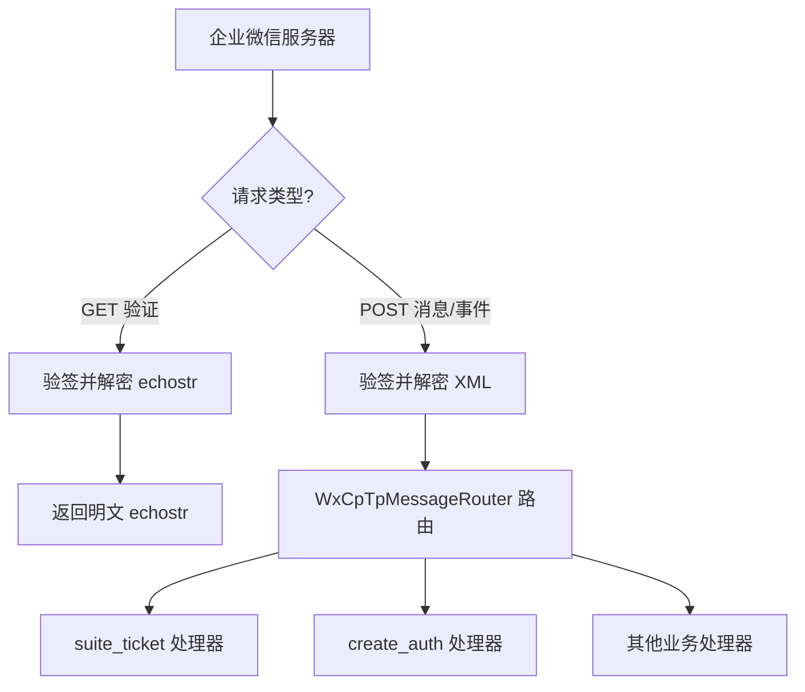
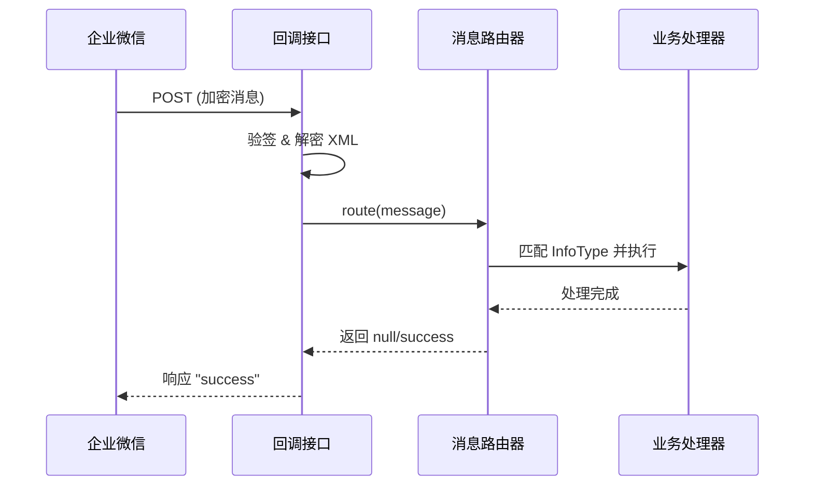

# **基于 WxJava 对接企业微信第三方应用**

## **一、为什么需要对接第三方应用？**

1. **多租户 SaaS 架构支持**：第三方应用（ISV）模式允许服务商通过一套代码、一个应用（Suite）服务成千上万家企业，无需为每个企业单独开发。
2. **集中化权限管理**：通过统一的授权回调，自动获取并管理企业的 `PermanentCode`，实现跨企业的消息推送与通讯录同步。
3. **安全与解耦**：将企业微信的加密解密、Token 刷新等繁琐底层逻辑交由 WxJava SDK 处理，业务代码只需关注核心逻辑，且配合 Redis 实现高可用。

## **二、核心对接原理**

1. 基本流程
   - 服务商在企业微信后台创建第三方应用，获取 `SuiteId` 和 `SuiteSecret`。
   - 配置回调 URL，接收企业微信定时推送的 `suite_ticket`（用于获取服务商 Token）。
   - 企业微信管理员授权后，推送 `create_auth` 事件，服务商获取并持久化 `PermanentCode`。
   - 根据租户 ID 动态构建 `WxCpService`，处理日常业务请求与消息回调。
2. 关键要素
   - `SuiteId` + `SuiteSecret`（服务商身份标识与密钥）
   - `PermanentCode`（企业授权后的永久凭证）
   - `WxCpTpMessageRouter`（消息路由器，按 InfoType 分发事件）
   - `RedisTemplate`（集中式缓存，管理多租户 Token 与 Ticket）

## **三、对接实现步骤**

1. 核心配置与多租户初始化
   - 注入 `WxCpTpConfigStorage`，绑定服务商基础凭证与 Redis。
   - 监听 `ApplicationReadyEvent`，从数据库加载已授权企业列表。
   - 遍历企业列表，动态生成 `WxCpService` 并缓存至内存 Map。
   - 初始化 `WxCpTpMessageRouter`，注册 `suite_ticket` 和 `create_auth` 处理器。
2. 回调接口统一接入
   - 暴露 GET/POST 接口，拦截企业微信的验证请求（带 `echostr`）。
   - 验签成功后，使用 `WxCpTpCryptUtil` 解密并原样返回 `echostr`。
   - 拦截 POST 消息请求，解密 XML 报文，交由 Router 进行异步/同步分发。



3. 消息回调处理逻辑



## **四、代码实现**

### **1. 引入依赖**

在 `pom.xml` 中添加 WxJava 企业微信模块依赖：

```java
<dependency>
    <groupId>com.github.binarywang</groupId>
    <artifactId>weixin-java-cp</artifactId>
</dependency>
```

> [!NOTE]
>
> 版本号由父 POM 统一管理，WxJava 建议使用最新稳定版（4.8.0）。

### **2. 配置文件（application.yml）**

在 `application.yml` 中添加企业微信第三方应用的基础配置：

```yaml
# 企业微信第三方应用配置
wx:
  tp:
    suite-id: xxx
    suite-secret: xxx
    token: xxx
    aes-key: xxx
```

| 配置项         | 说明                                           |
| -------------- | ---------------------------------------------- |
| `suite-id`     | 第三方应用的 SuiteId，在企业微信服务商后台获取 |
| `suite-secret` | 第三方应用的 SuiteSecret                       |
| `token`        | 回调配置的 Token，用于消息签名验证             |
| `aes-key`      | 回调配置的 EncodingAESKey，用于消息加解密      |

### **3. 核心配置类（WxCpTpConfig）**

该配置类负责：初始化服务商凭证存储、创建 `WxCpTpService`、启动时加载已授权企业并构建多租户 Service Map、注册消息路由规则。

```java
@Slf4j
@Configuration
@EnableConfigurationProperties(WxCpTpConfig.WxCpTpProperties.class)
@RequiredArgsConstructor
public class WxCpTpConfig {

    private final WxCpTpProperties wxCpTpProperties;
    private final StringRedisTemplate stringRedisTemplate;
    private final ScrmCompanyAuthorizationService scrmCompanyAuthorizationService;
    @Lazy
    @Autowired
    private WxCpTpService wxCpTpService;

    // 消息处理器
    private final SuiteTicketHandler suiteTicketHandler;
    private final CreateAuthHandler createAuthHandler;

    private static WxCpTpMessageRouter TP_ROUTER;
    private static Map<String, WxCpService> CP_SERVICE_MAP = new HashMap<>();

    @Bean
    public WxCpTpConfigStorage wxCpTpConfigStorage() {
        WxCpTpRedisTemplateConfigImpl configStorage = new WxCpTpRedisTemplateConfigImpl(stringRedisTemplate);
        configStorage.setSuiteId(wxCpTpProperties.suiteId);
        configStorage.setSuiteSecret(wxCpTpProperties.suiteSecret);
        configStorage.setToken(wxCpTpProperties.token);
        configStorage.setEncodingAESKey(wxCpTpProperties.aesKey);
        configStorage.setBaseApiUrl(wxCpTpProperties.baseApiUrl);
        return configStorage;
    }

    @Bean
    public WxCpTpService wxCpTpService(WxCpTpConfigStorage configStorage) {
        WxCpTpService tpService = new WxCpTpServiceImpl();
        tpService.setWxCpTpConfigStorage(configStorage);
        return tpService;
    }

    @EventListener(ApplicationReadyEvent.class)
    public void initServiceAndRouter() {
        List<ScrmCompanyAuthorization> list = scrmCompanyAuthorizationService.list();
        list = CollStreamUtils.filterList(list, item -> StringUtils.isNotBlank(item.getTenantId()));

        // service
        CP_SERVICE_MAP.clear();
        CP_SERVICE_MAP = CollStreamUtils.toMap(
                list,
                ScrmCompanyAuthorization::getTenantId,
                auth -> {
                    WxCpRedisTemplateConfigImpl config = new WxCpRedisTemplateConfigImpl(stringRedisTemplate, "workRedis:");
                    config.setCorpId(auth.getCorpId());
                    config.setCorpSecret(auth.getPermanentCode());
                    config.setAgentId(auth.getAgentId());
                    config.setBaseApiUrl(wxCpTpProperties.baseApiUrl);
                    var service = new WxCpServiceOnTpImpl(wxCpTpService);
                    service.setWxCpConfigStorage(config);
                    return service;
                });

        // router
        TP_ROUTER = this.newTpRouter(wxCpTpService);
    }

    private WxCpTpMessageRouter newTpRouter(WxCpTpService wxCpTpService) {
        var newRouter = new WxCpTpMessageRouter(wxCpTpService);

        // 推送suite_ticket
        newRouter.rule().async(false).infoType("suite_ticket").handler(suiteTicketHandler).end();
        // 授权成功通知
        newRouter.rule().async(true).infoType("create_auth").handler(createAuthHandler).end();

        return newRouter;
    }

    public static WxCpService getCpService() {
        return getCpService(UserHolder.getTenantId());
    }

    public static WxCpService getCpService(String tenantId) {
        return Optional.ofNullable(tenantId)
                .map(CP_SERVICE_MAP::get)
                .orElseThrow(() -> new BusinessException(CommonErrorEnum.OPERATION_ERROR, "未初始化WxCpService," + "tenantId:" + tenantId));
    }

    public static WxCpTpMessageRouter getRouter() {
        return TP_ROUTER;
    }

    @Data
    @ConfigurationProperties(prefix = "wx.tp")
    public static class WxCpTpProperties {

        private String suiteId;

        private String suiteSecret;

        private String token;

        private String aesKey;

        private String baseApiUrl;
    }
}
```

### **4. 回调接口实现（消息通知与验证）**

该接口统一处理企业微信的回调请求，包括：GET 验证（`echostr` 解密回传）和 POST 消息接收（解密 XML 后交由 Router 分发）。

```java
@Slf4j
@Service
@RequiredArgsConstructor
public class WxCpTpCallbackServiceImpl implements WxCpTpCallbackService {

    private final WxCpTpConfigStorage wxCpConfigStorage;
    private final WxCpTpService wxCpTpService;

    @SneakyThrows
    @Override
    public void commandCallback() {
        HttpServletRequest request = SpringContextUtils.getHttpServletRequest();
        HttpServletResponse response = SpringContextUtils.getHttpServletResponse();
        response.setContentType("text/html;charset=utf-8");
        response.setStatus(HttpServletResponse.SC_OK);

        String msgSignature = request.getParameter("msg_signature");
        String nonce = request.getParameter("nonce");
        String timestamp = request.getParameter("timestamp");
        String echostr = request.getParameter("echostr");
        log.info("msgSignature: {}, timestamp: {}, nonce: {}, echostr: {}", msgSignature, timestamp, nonce, echostr);

        // 有 echostr，GET 请求验证服务是否具备解析企业微信推送消息的能力
        if (StringUtils.isNotBlank(echostr)) {
            if (!wxCpTpService.checkSignature(msgSignature, timestamp, nonce, echostr)) {
                response.getOutputStream().write("fail".getBytes(StandardCharsets.UTF_8));
                return;
            }
            WxCpTpCryptUtil cryptUtil = new WxCpTpCryptUtil(wxCpConfigStorage);
            String plainText = cryptUtil.decrypt(echostr);
            // 企业号应用在开启回调模式的时候，会传递加密echostr给服务器，需要解密并echo才能接入成功
            response.getOutputStream().write(plainText.getBytes(StandardCharsets.UTF_8));
            return;
        }

        // 如果没有 echostr，则说明传递过来的用户消息，在解密方法里会自动验证消息是否合法
        WxCpTpXmlMessage message = WxCpTpXmlMessage.fromEncryptedXml(getRawBody(request), wxCpConfigStorage, timestamp, nonce, msgSignature);
        log.info("WxCpTpXmlMessage: {}", message.getAllFieldsMap());
        this.route(message);

        // 相应返回
        response.getOutputStream().write("success".getBytes(StandardCharsets.UTF_8));
    }

    @SneakyThrows
    @Override
    public void dataCallback() {
        HttpServletRequest request = SpringContextUtils.getHttpServletRequest();
        HttpServletResponse response = SpringContextUtils.getHttpServletResponse();
        response.setContentType("text/html;charset=utf-8");
        response.setStatus(HttpServletResponse.SC_OK);

        String msgSignature = request.getParameter("msg_signature");
        String nonce = request.getParameter("nonce");
        String timestamp = request.getParameter("timestamp");
        String echostr = request.getParameter("echostr");
        log.info("msgSignature: {}, timestamp: {}, nonce: {}, echostr: {}", msgSignature, timestamp, nonce, echostr);

        // 有 echostr，GET 请求验证服务是否具备解析企业微信推送消息的能力
        if (StringUtils.isNotBlank(echostr)) {
            if (!wxCpTpService.checkSignature(msgSignature, timestamp, nonce, echostr)) {
                response.getOutputStream().write("fail".getBytes(StandardCharsets.UTF_8));
                return;
            }
            WxCpTpCryptUtil cryptUtil = new WxCpTpCryptUtil(wxCpConfigStorage);
            String plainText = cryptUtil.decrypt(echostr);
            // 企业号应用在开启回调模式的时候，会传递加密echostr给服务器，需要解密并echo才能接入成功
            response.getOutputStream().write(plainText.getBytes(StandardCharsets.UTF_8));
            return;
        }

        // 如果没有 echostr，则说明传递过来的用户消息，在解密方法里会自动验证消息是否合法
        WxCpTpXmlMessage message = WxCpTpXmlMessage.fromEncryptedXml(getRawBody(request), wxCpConfigStorage, timestamp, nonce, msgSignature);
        log.info("WxCpTpXmlMessage: {}", message.getAllFieldsMap());
        this.route(message);

        response.getOutputStream().write("success".getBytes(StandardCharsets.UTF_8));
    }

    private WxCpXmlOutMessage route(WxCpTpXmlMessage message) {
        return WxCpTpConfig.getRouter().route(message);
    }

    private String getRawBody(HttpServletRequest request) throws IOException {
        InputStream is = request.getInputStream();
        return new String(is.readAllBytes(), StandardCharsets.UTF_8);
    }
}
```

## **五、消息路由处理器（Handler）**

Router 根据消息的 `InfoType` 将事件分发到对应的 Handler 处理。以下是两个核心处理器：

### **5.1 SuiteTicketHandler（接收 suite_ticket）**

企业微信每隔 10 分钟推送一次 `suite_ticket`，用于后续获取服务商 `suite_access_token`。必须同步处理并缓存。

```java
@Slf4j
@Component
@RequiredArgsConstructor
public class SuiteTicketHandler implements WxCpTpMessageHandler {

    @Override
    public WxCpXmlOutMessage handle(WxCpTpXmlMessage wxMessage, Map<String, Object> context,
                                    WxCpTpService wxCpService, WxSessionManager sessionManager) throws WxErrorException {
        wxCpService.setSuiteTicket(wxMessage.getSuiteTicket());
        return null;
    }
}
```

### **5.2 CreateAuthHandler（授权成功通知）**

企业管理员授权安装应用后，企业微信推送 `create_auth` 事件，携带 `AuthCode`，用于换取 `PermanentCode`（永久授权码）。

```java
@Slf4j
@Component
@RequiredArgsConstructor
public class CreateAuthHandler implements WxCpTpMessageHandler {

    private final ScrmCompanyAuthorizationService scrmCompanyAuthorizationService;

    @Override
    public WxCpXmlOutMessage handle(WxCpTpXmlMessage wxMessage, Map<String, Object> context, WxCpTpService wxCpService, WxSessionManager sessionManager) throws WxErrorException {
        try {
            WxCpTpPermanentCodeInfo permanentCodeInfo = wxCpService.getPermanentCodeInfo(wxMessage.getAuthCode());
            ScrmCompanyAuthorization companyAuthorization = scrmCompanyAuthorizationService.getBy(ScrmCompanyAuthorization::getCorpId, permanentCodeInfo.getAuthCorpInfo().getCorpId());
            if (companyAuthorization == null) {
                companyAuthorization = new ScrmCompanyAuthorization();
            }
            companyAuthorization.setCorpId(permanentCodeInfo.getAuthCorpInfo().getCorpId());
            companyAuthorization.setCorpName(permanentCodeInfo.getAuthCorpInfo().getCorpName());
            companyAuthorization.setPermanentCode(permanentCodeInfo.getPermanentCode());
            companyAuthorization.setUserId(permanentCodeInfo.getAuthUserInfo().getUserId());
            companyAuthorization.setName(permanentCodeInfo.getAuthUserInfo().getName());
            companyAuthorization.setAgentId(permanentCodeInfo.getAuthInfo().getAgents().get(0).getAgentId());
            scrmCompanyAuthorizationService.saveOrUpdate(companyAuthorization);
        } catch (WxErrorException e) {
            log.error("CreateAuthHandler fail: {}", e.getMessage());
        }
        return null;
    }
}
```
---
`2026-07-01` | [@kouyang](https://github.com/kou-yang)