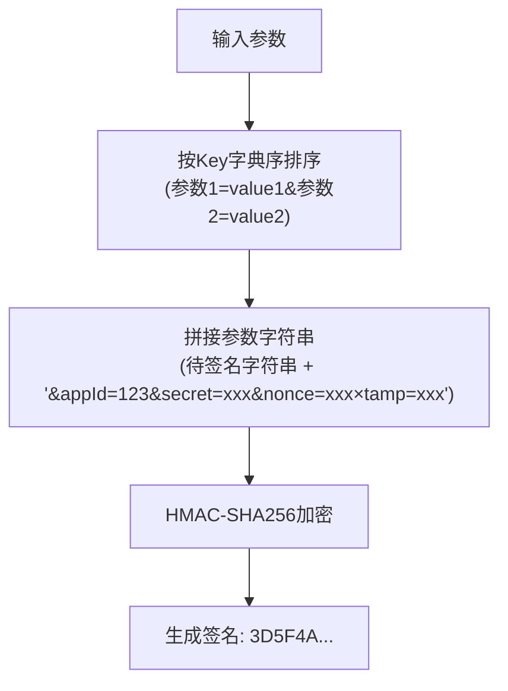
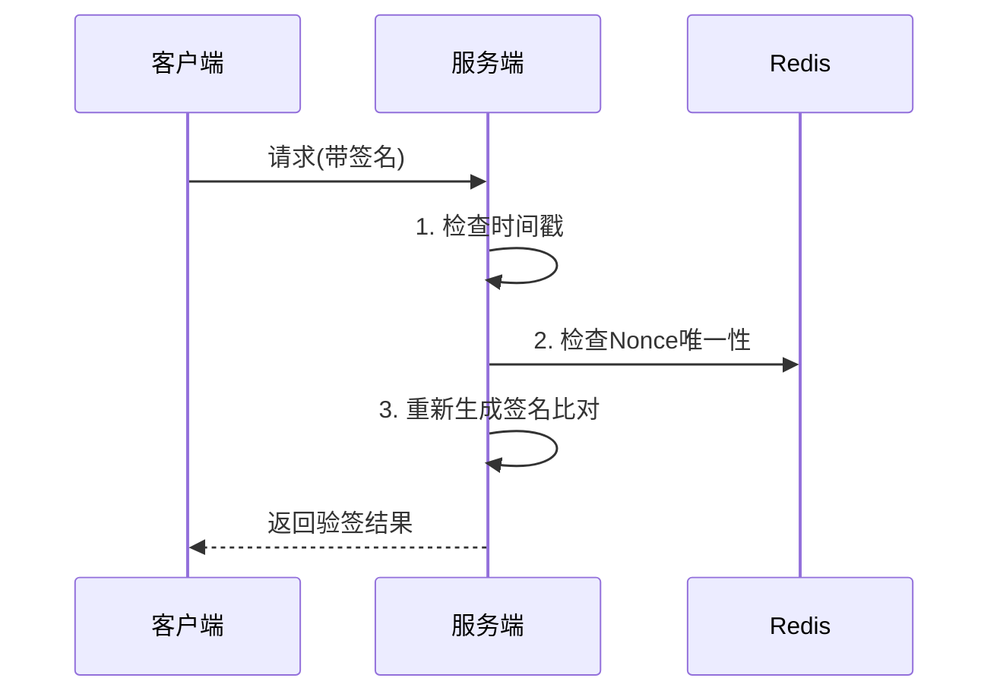

# 如何实现 API 接口参数签名？

## 一、为什么需要参数签名？

1. **防篡改**：网络传输中参数可能被拦截修改（如将amount=100改为amount=10000），签名可验证数据完整性。
2. **防重放**：攻击者截获请求后重复发送（如重复支付），通过`Timestamp+Nonce`避免。
3. **身份验证**：通过`AppID`和`SecretKey`确认调用方身份。

## 二、参数签名的核心原理

1. 基本流程
    - 客户端与服务端约定签名算法和密钥
    - 参数排序 + 密钥加密 → 生成签名
    - 服务端验签
2. 关键要素
    - `AppID` + `SecretKey`（身份标识与密钥）
    - `Timestamp`（防止重放）
    - `Nonce`（随机数防重复）
    - 参数字典序排序（避免顺序不一致导致签名失败）

## 三、签名实现步骤

1. 客户端生成签名
    - 过滤空参数 + 按Key字典序排序
    - 拼接参数字符串（如 `k1=v1&k2=v2&appId=123&secret=xxx&nonce=xxx&timestamp=xxx`）
    - HMAC-SHA256 加密生成签名
    - 将签名加入请求头（如 `X-Signature: abc123`）



2. 服务端验签

    - 重复相同步骤生成签名，对比客户端传来的签名是否一致。

    - 检查`Timestamp`是否在有效期内（如±5分钟）。




## 四、代码实现

1. 请求示例

```http
POST /api/your-path HTTP/1.1
Host: your-host
Content-Type: application/json
X-Signature: 签名值
X-Nonce: 随机数
X-Timestamp: 请求时间戳

{
    "param1": "value1",
    "param2": "value2"
}
```

2. Java 示例

```java
@Order(0)
@Slf4j
@Component
public class SignatureInterceptors implements HandlerInterceptor {

    @Override
    public boolean preHandle(HttpServletRequest request, HttpServletResponse response, Object handler) {
        String appId = request.getHeader("X-AppId");
        String signature = request.getHeader("X-Signature");
        String nonce = request.getHeader("Nonce");
        Long timestamp = Optional.ofNullable(request.getHeader("Timestamp")).map(Long::valueOf).orElse(null);
        if (ObjectUtils.anyNull(signature, nonce, timestamp)) {
            throw new BusinessException(CommonErrorEnum.PARAMS_ERROR, "请求头缺失，请求无效");
        }
        // 1 检查 timestamp 是否超出允许的范围
        long timestampDisparity = Math.abs(System.currentTimeMillis() - timestamp);
        if (timestampDisparity > SignatureConstant.ALLOW_DISPARITY) {
            throw new BusinessException(CommonErrorEnum.PARAMS_ERROR, "timestamp 时间差超出允许的范围，请求无效");
        }
        // 2 检查此 nonce 是否已被使用过
        if (Objects.nonNull(RedisUtils.get(RedisKey.getKey(RedisKey.NONCE, nonce)))) {
            throw new BusinessException(CommonErrorEnum.PARAMS_ERROR, "此 nonce 已被使用过，请求无效");
        }
        // 3 验证签名
        CustomHttpServletRequestWrapper wrapper = new CustomHttpServletRequestWrapper(request);
        String body = wrapper.getBody();
        // 此处 secret 需要从数据库中获取（getSecretByAppId()）
        String secret = "xxx";
        String sign = this.buildSignature(body, nonce, timestamp, secret);
        if (!Objects.equals(signature, sign)) {
            log.info("appId: {}, body: {}, receive: {}, expect: {}", appId, body, signature, sign);
            throw new BusinessException(CommonErrorEnum.PARAMS_ERROR, "签名验证失败，请求无效");
        }
        // 4 将 nonce 记入缓存，防止重复使用，此处需要将 ttl 设定为允许 timestamp 时间差的值 x 2
        RedisUtils.set(RedisKey.getKey(RedisKey.NONCE, nonce), "1", SignatureConstant.ALLOW_DISPARITY * 2, TimeUnit.MILLISECONDS);
        return true;
    }

    @Override
    public void afterCompletion(HttpServletRequest request, HttpServletResponse response, Object handler, Exception ex) throws Exception {

    }

    @SneakyThrows
    private String buildSignature(String body, String nonce, Long timestamp, String secret) {
        StringBuilder result = new StringBuilder();
        if (StringUtils.isNotBlank(body)) {
            ObjectMapper mapper = new ObjectMapper();
            // 将 JSON 字符串按字典排序（包含嵌套 JSON）
            Map<String, Object> sortedMap = mapper.readValue(body, TreeMap.class);
            sortedMap = sortMapRecursively(sortedMap);
            // 拼接字符串
            for (Map.Entry<String, Object> entry : sortedMap.entrySet()) {
                result.append(entry.getKey()).append("=").append(entry.getValue()).append("\n");
            }
        }
        result.append("nonce=").append(nonce).append("\n");
        result.append("timestamp=").append(timestamp).append("\n");
        return hmac_sha256(secret, result.toString());
    }

    private Map<String, Object> sortMapRecursively(Map<String, Object> map) {
        Map<String, Object> sortedMap = new TreeMap<>();
        map.forEach((key, value) -> {
            if (value instanceof Map) {
                sortedMap.put(key, sortMapRecursively((Map<String, Object>) value));
            } else if (value instanceof Iterable) {
                sortedMap.put(key, sortListRecursively((Iterable<?>) value));
            } else {
                sortedMap.put(key, value);
            }
        });
        return sortedMap;
    }

    private Object sortListRecursively(Iterable<?> iterable) {
        List<Object> sortedList = new ArrayList<>();
        iterable.forEach(item -> {
            if (item instanceof Map) {
                sortedList.add(sortMapRecursively((Map<String, Object>) item));
            } else if (item instanceof Iterable) {
                sortedList.add(sortListRecursively((Iterable<?>) item));
            } else {
                sortedList.add(item);
            }
        });
        return sortedList;
    }

    @SneakyThrows
    private String hmac_sha256(String key, String data) {
        byte[] keyBytes = key.getBytes(StandardCharsets.UTF_8);
        SecretKeySpec secretKeySpec = new SecretKeySpec(keyBytes, "HmacSHA256");
        Mac mac = Mac.getInstance("HmacSHA256");
        mac.init(secretKeySpec);
        byte[] hmacSha256Bytes = mac.doFinal(data.getBytes(StandardCharsets.UTF_8));
        return Base64.getEncoder().encodeToString(hmacSha256Bytes);
    }
}
```

---

`2025-05-16` | [@kouyang](https://github.com/kou-yang)